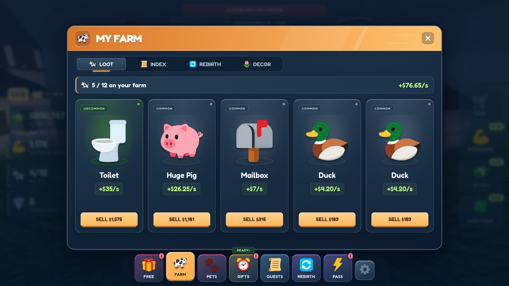

# Tornado-survival GUI kit — version 2

**[View the 11 finished full-screen designs](FULL_SCREENS.md)** · **[Current style and reusable assets](POLISHED_DESIGN.md)** · **[Claude Code handoff](CLAUDE_CODE_HANDOFF.md)**

Version 2 redesigns the buttons, cards, panels, tabs and HUD with cleaner beveled controls, blue surfaces, subtle rarity accents and larger item artwork. All menu text, prices, rewards, timers and stats are unchanged from the previous full-screen pack. No stud patterns.



## Preview

1. On the repository home page, choose **Code → Download ZIP**.
2. Extract the complete ZIP.
3. Open **`gui-assets/screens.html`** in your browser.

Use the screen selector, bottom navigation and Farm/Pets tabs. Press Escape or the close button to return to the HUD. **Opening an HTML file on GitHub shows its source; download and extract it first.** Do not run `screens.js` by itself.

The preview works offline without installation. Keep the entire folder together. Open `preview.html` for the asset library: current v2 surfaces appear first; previous v1 surfaces are labeled legacy.

Optional local serving from the repository root:

```bash
python3 -m http.server 8030 --directory gui-assets --bind 127.0.0.1
```

Open `screens.html` through that server in your own browser. Stop with Ctrl+C. The cloud onboarding UI does not provide a public web preview.

## Current assets

| File | Contents |
| --- | --- |
| `screens/*.png` | 11 complete 1920 × 1080 designs, plus presentation scenery |
| `textures/polished-surfaces.png` | 23 blank buttons, rarity cards, headers, tabs, modal and HUD panel; 1536 × 1408 RGBA |
| `textures/navigation-icons.png` | 16 familiar navigation/game icons; 1254 × 1254 RGBA |
| `textures/menu-items.png` | 24 matching item/pet illustrations; 1536 × 1024 RGBA |
| `screens.html`, `screens.css`, `screens-polish.css`, `screens.js` | Editable layouts, appearance and sample data |
| `surface-kit.html`, `surface-kit.js` | Blank surfaces sharing the same appearance rules as the screens |

The **63 current reusable elements** are on three transparent atlases. Exact rectangles and nine-slice information are in `surface-manifest.json`, `manifest.json` (icons) and `content-manifest.json` (items). Never assume equal grid cells.

The four older headers/controls/cards/panel PNGs remain available for compatibility. Use the new polished surface atlas when matching the current full-screen designs.

## Give to Claude Code

Give Claude the **entire `gui-assets` folder**, [CLAUDE_CODE_HANDOFF.md](CLAUDE_CODE_HANDOFF.md), and the actual Roblox game project.

The new `roblox/StormGuiSurfaces.luau` adapter applies the polished surfaces. `StormGuiAssets.luau` supplies the existing icons; `ScreenItemAssets.luau` supplies optional item art. Upload the three current atlases under your experience owner/group and set their real image IDs. No Roblox image IDs are fabricated or supplied.

Read [POLISHED_DESIGN.md](POLISHED_DESIGN.md) for button label colors, transparent padding, header alignment, resizing and native Roblox alternatives. Use full-screen PNGs as visual references, with editable native labels and functioning controls in the live game. The scenery is presentation-only.

## Validation and optional export

File validation uses Python 3's standard library:

```bash
python3 gui-assets/tools/validate_assets.py
```

Optional regeneration uses Node.js, Playwright and Chromium as described in [FULL_SCREENS.md](FULL_SCREENS.md):

```bash
node gui-assets/tools/export_surfaces.cjs
node gui-assets/tools/export_screens.cjs
```

The browser checks menu text against the pre-redesign snapshot, verifies full-width headers and layout bounds, and exercises tabs, navigation, close/Escape and preview-only actions. [VALIDATION.md](VALIDATION.md) records completed checks and the Studio checks that remain.

## References

[REFERENCE_MAP.md](reference/REFERENCE_MAP.md) distinguishes your original menus from the later viral-game style references. Original screenshots and the root README are unchanged. The repository contains the art kit and screenshots, not the live game's source; economy, multiplayer and purchase logic have not been modified.
