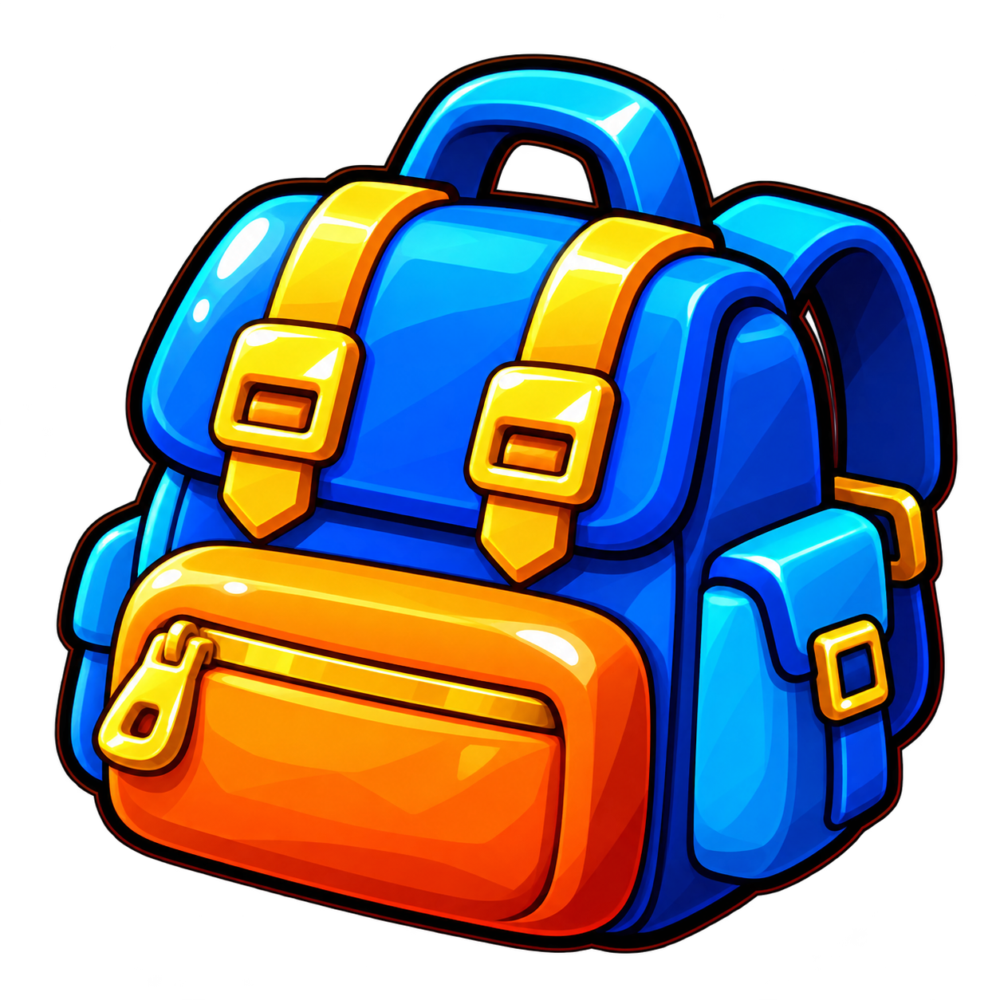
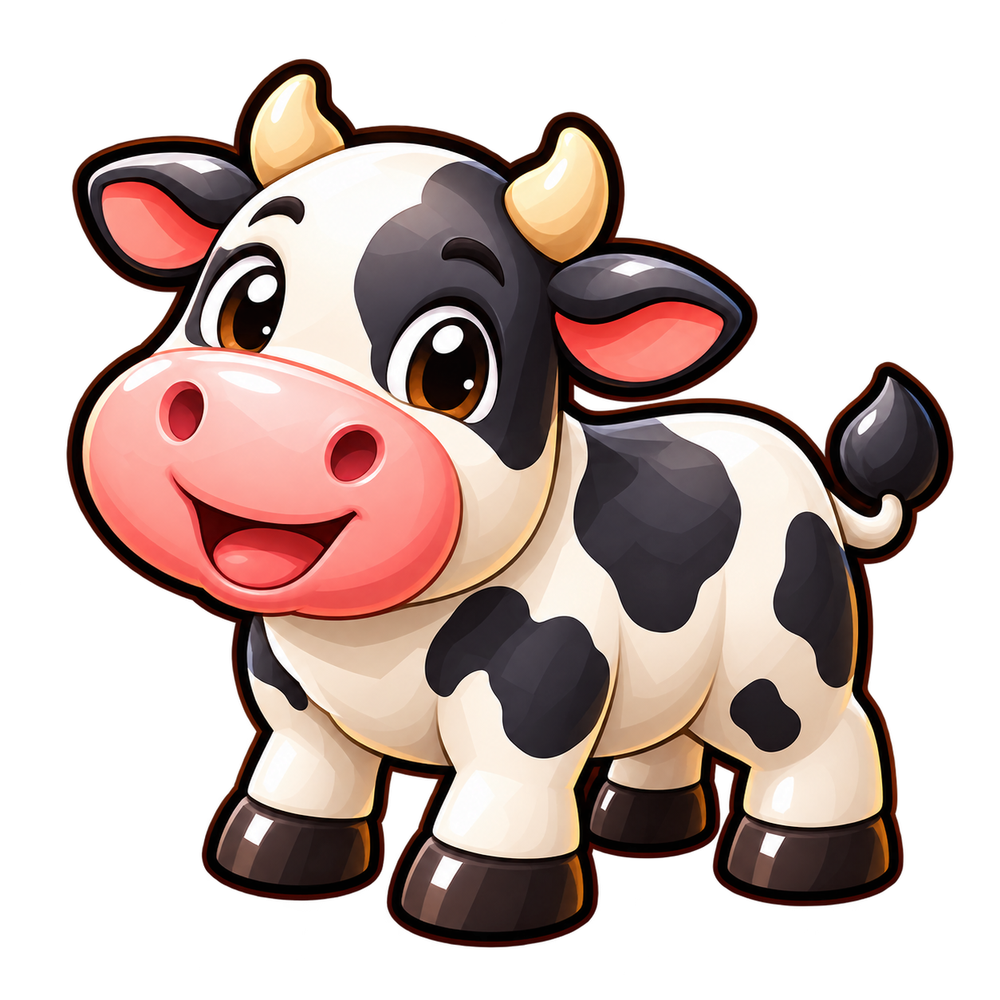
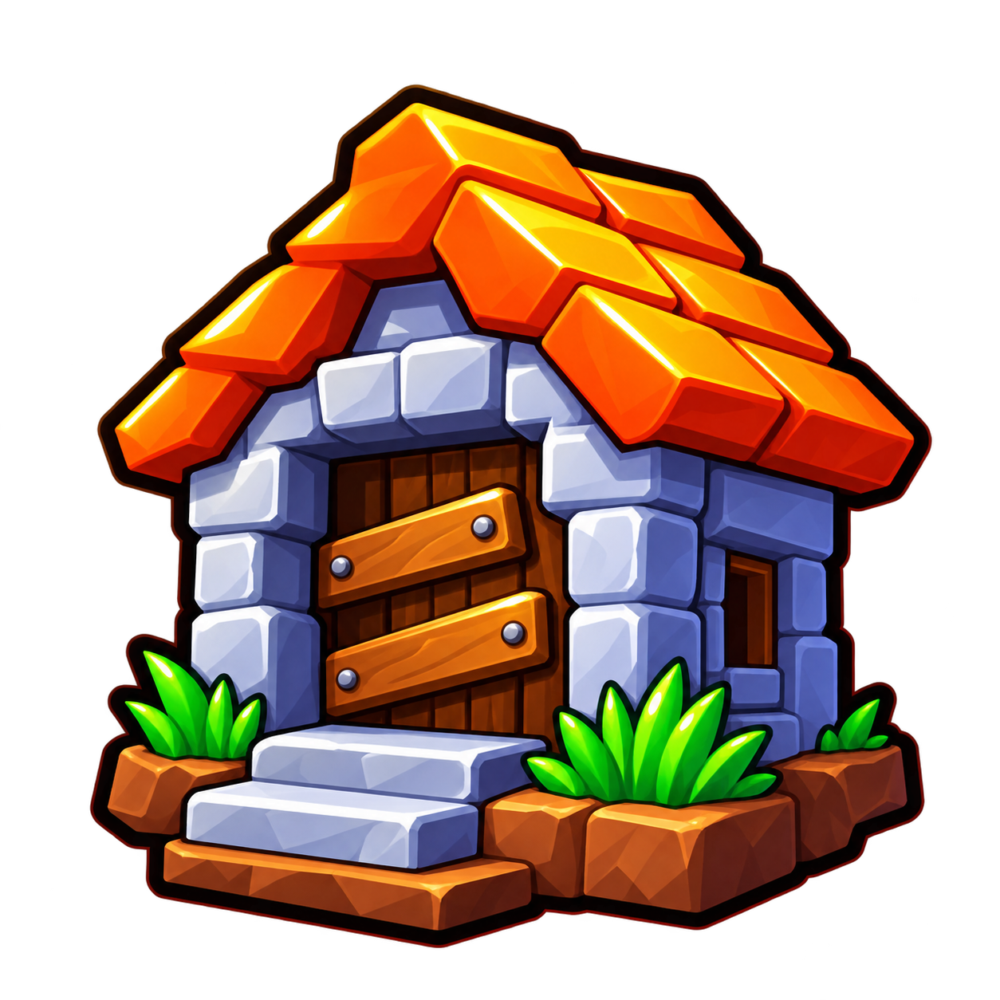
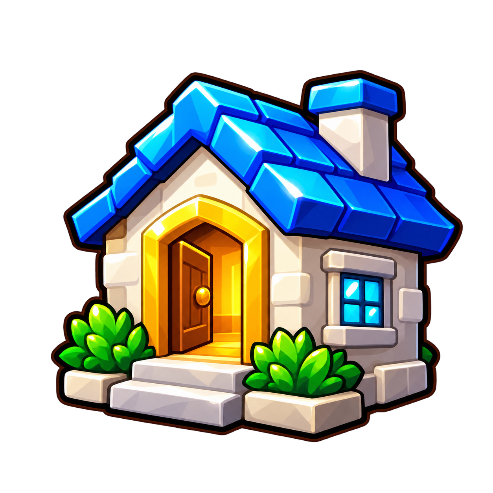

# Original-style menu icons

Six standalone **1254 × 1254 transparent PNGs** in the glossy, chunky style of the [first icon set](https://github.com/harryflax/gui-tornado/blob/02d95a8/gui-assets/textures/navigation-icons.png): saturated colors, bold dark outlines, dimensional shading and bright highlights.

| Game action | Finished PNG | Design |
| --- | --- | --- |
| Shop | [shop-cart.png](shop-cart.png) | Cyan shopping cart, gold frame, red handle |
| Menu | [menu-backpack.png](menu-backpack.png) | Blue backpack, orange front pocket |
| Farm | [farm-cow.png](farm-cow.png) | Black-and-white cow with pink muzzle |
| My Farm | [my-farm-house.png](my-farm-house.png) | Orange-roof stone survival house |
| Lobby | [lobby-house.png](lobby-house.png) | Blue-roof welcoming house with open doorway |
| Badges | [badges-medal.png](badges-medal.png) | Gold star medal with red ribbon |

| Shop | Menu | Farm |
| --- | --- | --- |
|  |  |  |
| **My Farm** | **Lobby** | **Badges** |
|  |  |  |

[View the complete set at menu sizes](overview.png).

## Preview and download

Download the repository ZIP and extract it, then open `gui-assets/icons-classic/preview.html` in a browser. It shows the six icons on dark and light backgrounds, with download links. Each icon is a complete standalone image with transparent padding, ready to upload individually. `manifest.json` records the measured dimensions and SHA-256 hashes.

## Instructions for Claude Code

Use these six images for their named navigation actions in my existing Roblox game. Match the original glossy icon style. Keep my current menu labels, buttons, information and gameplay bindings.

1. Upload each whole PNG under the experience owner/group. Obtain the real image content IDs; do not invent IDs. No image upload to Roblox has been performed in this repository.
2. Set the six entries in `ClassicMenuIcons.ImageIds` in the included `ClassicMenuIcons.luau` module.
3. Apply the corresponding image to the existing icon ImageLabel/ImageButton. The keys are `shop`, `menu`, `farm`, `myFarm`, `lobby`, `badges`.
4. Keep icons square with `UIAspectRatioConstraint` and `ScaleType.Fit`. The files include transparent margins; size the image inside the existing button until the visible art matches neighboring icons. Test at 48, 64 and 80 displayed pixels.
5. My Farm uses the orange-roof house. Lobby uses the blue-roof house. Farm uses the cow. Keep these three actions distinct.
6. Retain existing labels, click/touch/gamepad handlers, selection state and menu-opening logic. The module changes image appearance only.

```lua
local Icons = require(path.To.ClassicMenuIcons)
Icons.Apply(existingShopIcon, "shop")
Icons.Apply(existingMenuIcon, "menu")
Icons.Apply(existingFarmIcon, "farm")
Icons.Apply(existingMyFarmIcon, "myFarm")
Icons.Apply(existingLobbyIcon, "lobby")
Icons.Apply(existingBadgesIcon, "badges")
```

Replace the example instance/module paths with the actual project hierarchy. Studio is required to verify uploaded image permissions, moderation and final rendering.
